# Cloud-Based Data Analytics Dashboard (AWS)

## 📌 Overview

This project demonstrates a cloud-based data analytics pipeline using AWS services.

It processes raw data stored in Amazon S3 and performs analysis using AWS Glue and Amazon Athena.

---

## 🛠️ Technologies Used

* Amazon S3 – Data storage
* AWS Glue – Data catalog and crawler
* Amazon Athena – SQL-based data analysis

---

## ⚙️ Workflow

1. Upload dataset to S3 bucket
2. Create Glue database
3. Run Glue crawler to generate table
4. Query data using Athena
5. Analyze insights

---

## 📊 SQL Queries

### View Raw Data

```sql
SELECT * FROM raw_data;
```

### Revenue by Region

```sql
SELECT region, SUM(revenue) AS total_revenue
FROM raw_data
GROUP BY region;
```

### Sales by Product

```sql
SELECT product, SUM(quantity) AS total_sales
FROM raw_data
GROUP BY product;
```

### Revenue by Category

```sql
SELECT category, SUM(revenue) AS revenue
FROM raw_data
GROUP BY category;
```

### Daily Revenue

```sql
SELECT date, SUM(revenue) AS daily_revenue
FROM raw_data
GROUP BY date
ORDER BY date;
```

---

## 🖼️ Screenshots

### S3 Upload

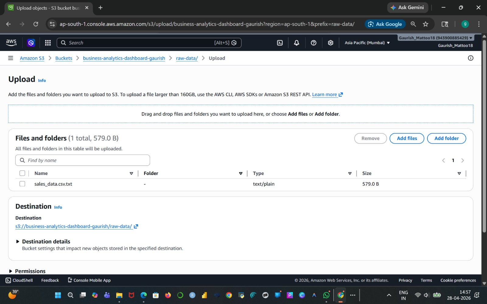

### Upload Success

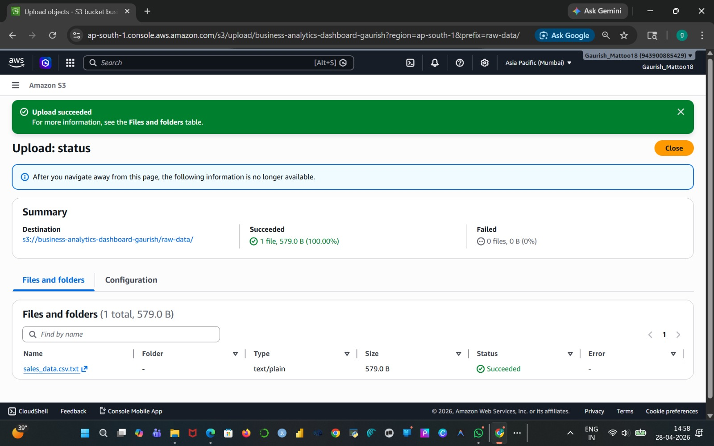

### CSV File

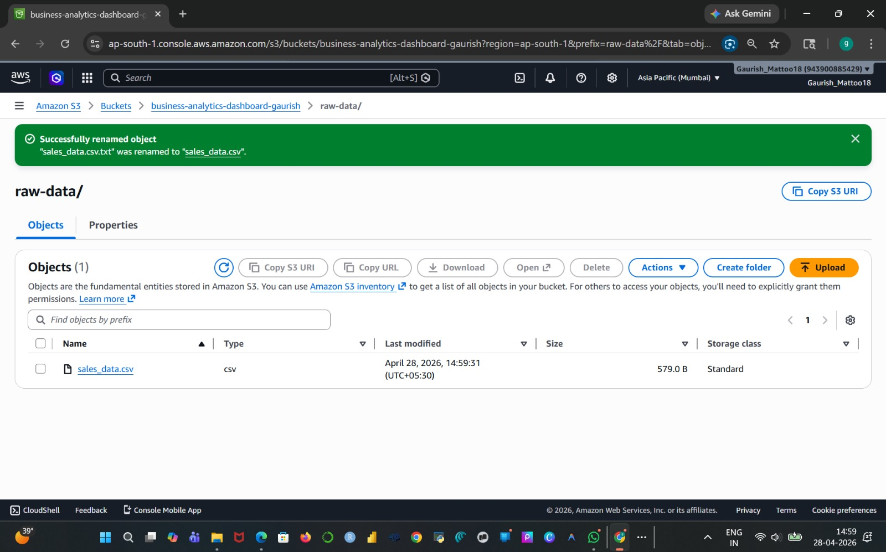

### Glue Database

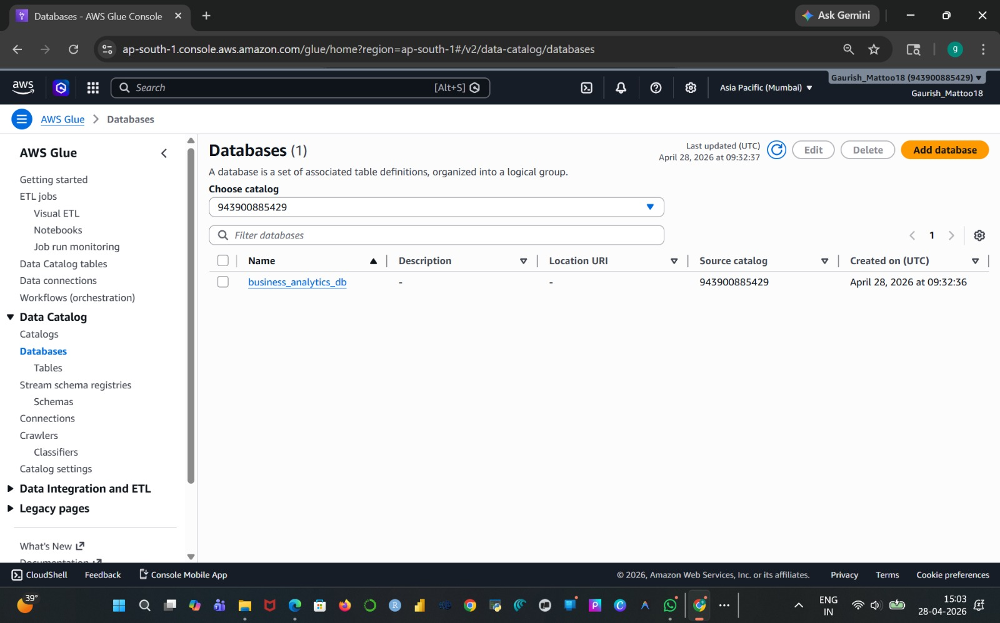

### Glue Crawler

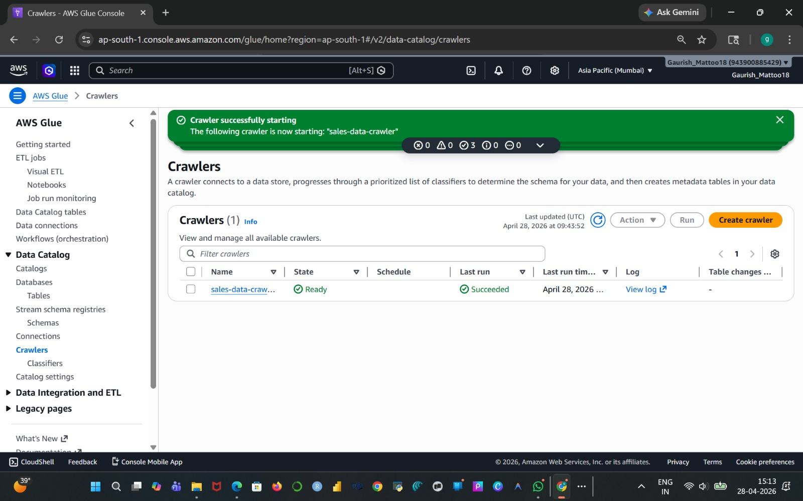

### Glue Table

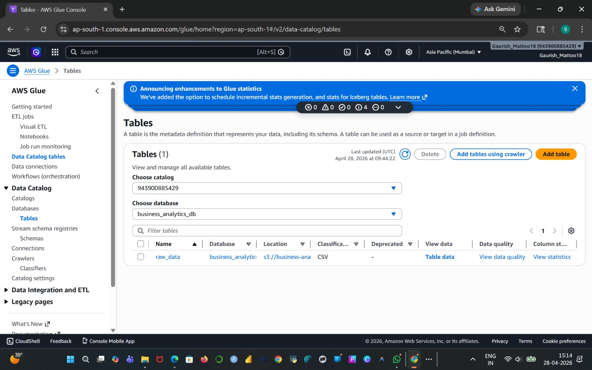

### Athena Queries

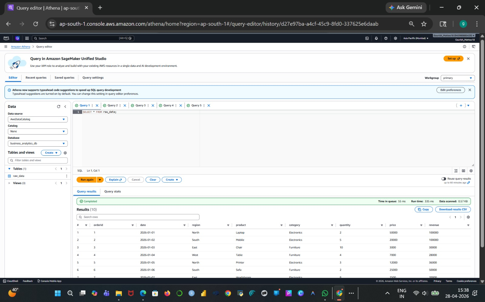
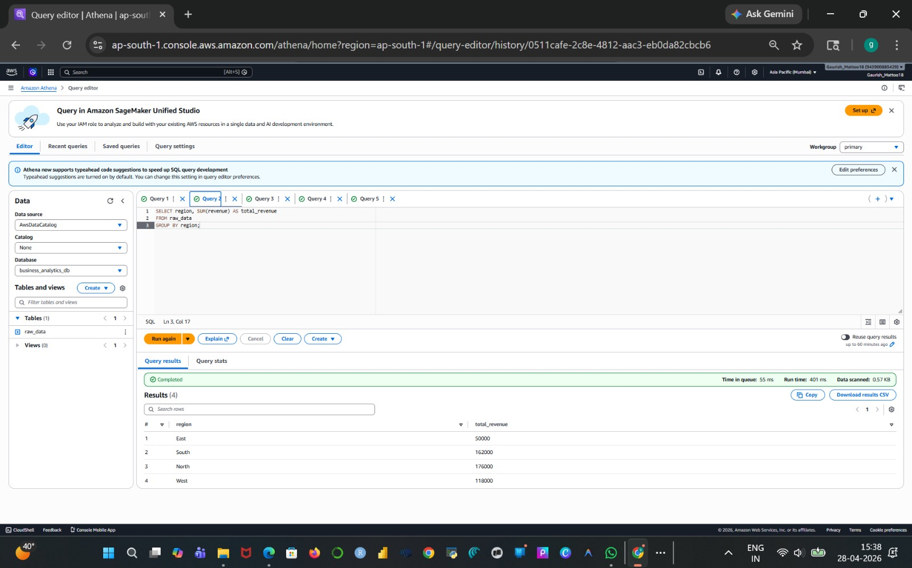
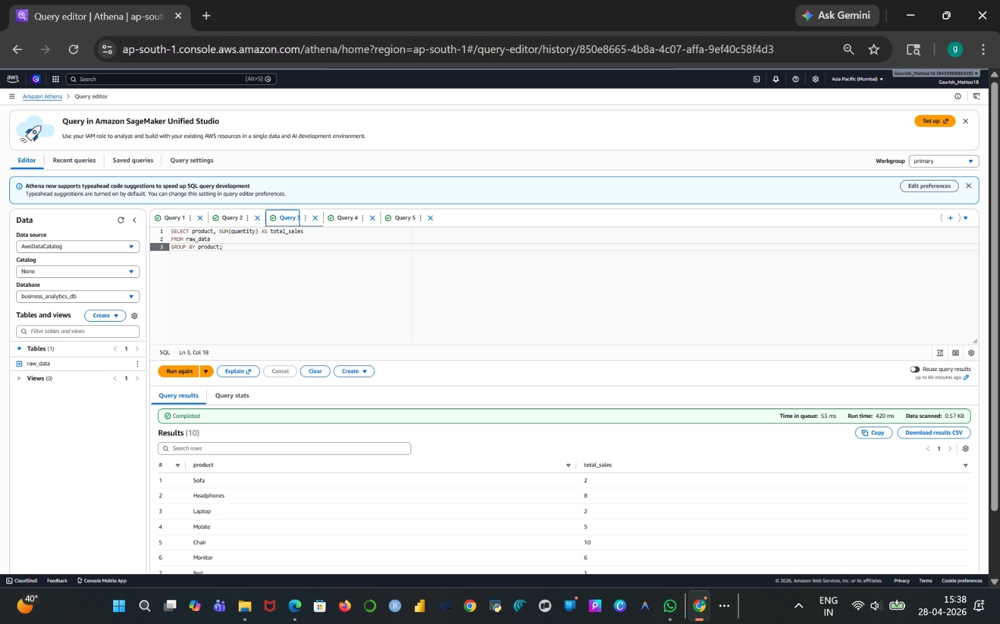
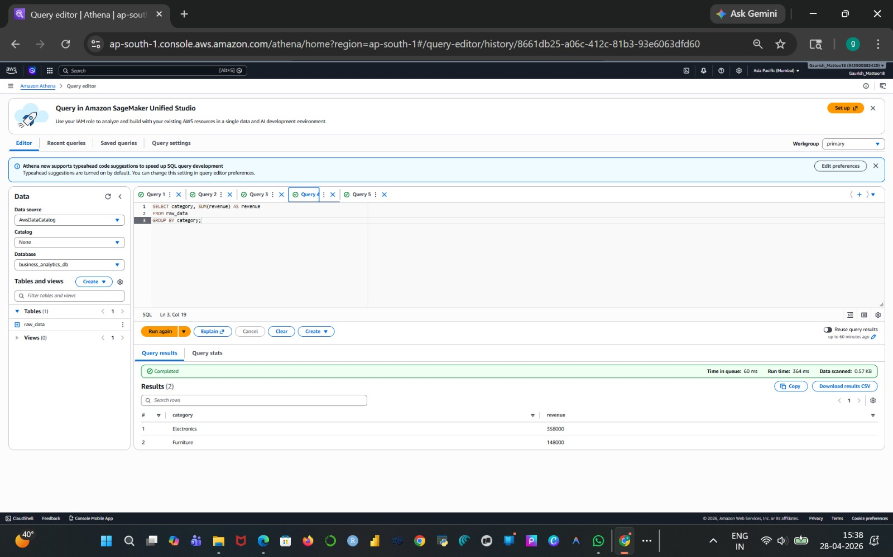
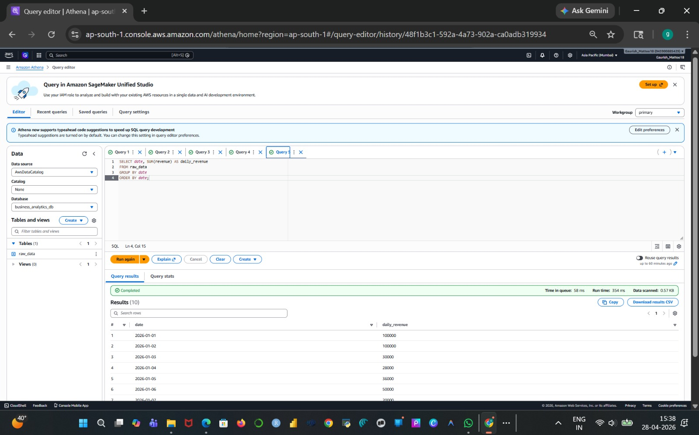

---

## ✅ Conclusion

This project shows how AWS can be used for scalable and serverless data analytics.

---

## 👨‍💻 Author

Gaurish Mattoo
